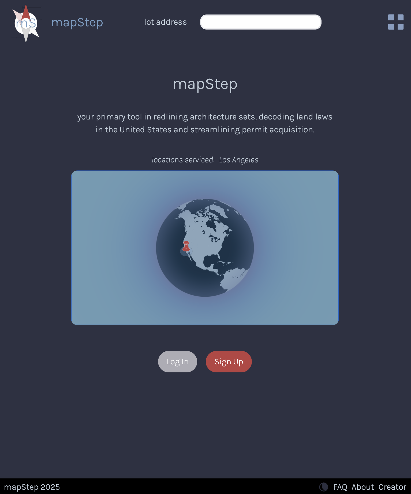
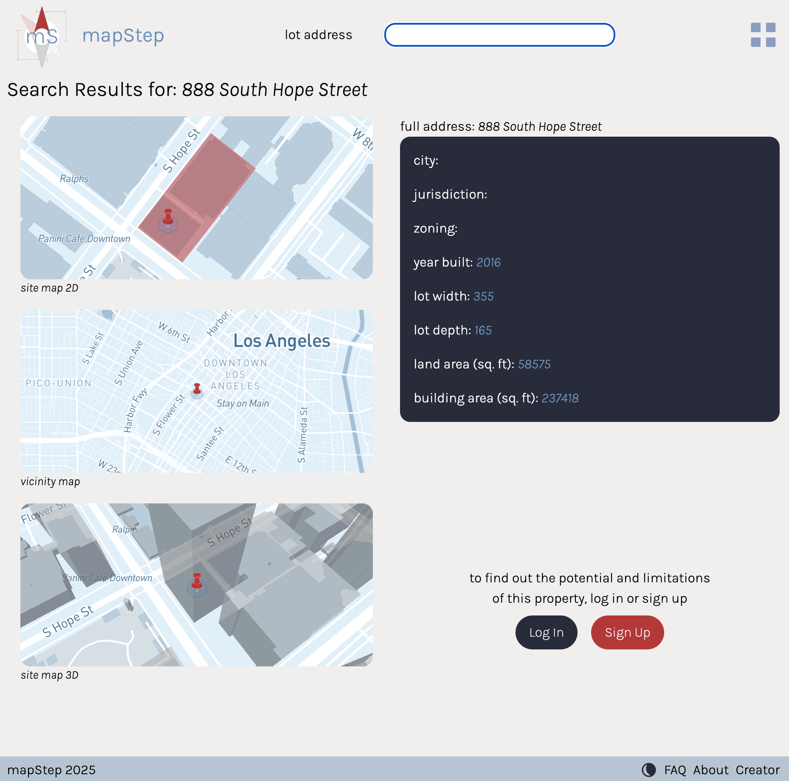

# mapstep.io front-end application

Tech stack:
- **JavaScript** - front-end programming language
- **React + Vite** – Component-based single-page application UI framework
- **Axios** – HTTP client for backend communication  
- [**Mapbox GL JS**](https://www.mapbox.com/) – Interactive mapping and geospatial visualization  
- **Google Maps Javascript API** – Google Maps tools such as autocomplete
- **@turf/rewind** – GeoJSON geometry utilities  
- **React Modal** – Use of modals for authentication
- **React PDF** – In-browser PDF rendering  
- **js-cookie** – Cookie and session management
- **Tailwinds** - CSS library

Front-end deployment:
- **Netlify** - front-end hosting, CI/CD
- [**mapstep.io**](https://mapstep.io/) - custom domain

Prototyping & Design:
- **Figma** - UX/UI prototyping, React front-end architecture
- **Adobe Illustrator** - logo/brand design

Locations serviced:
- Los Angeles County, California

#### home page in dark mode

#### sample search page
